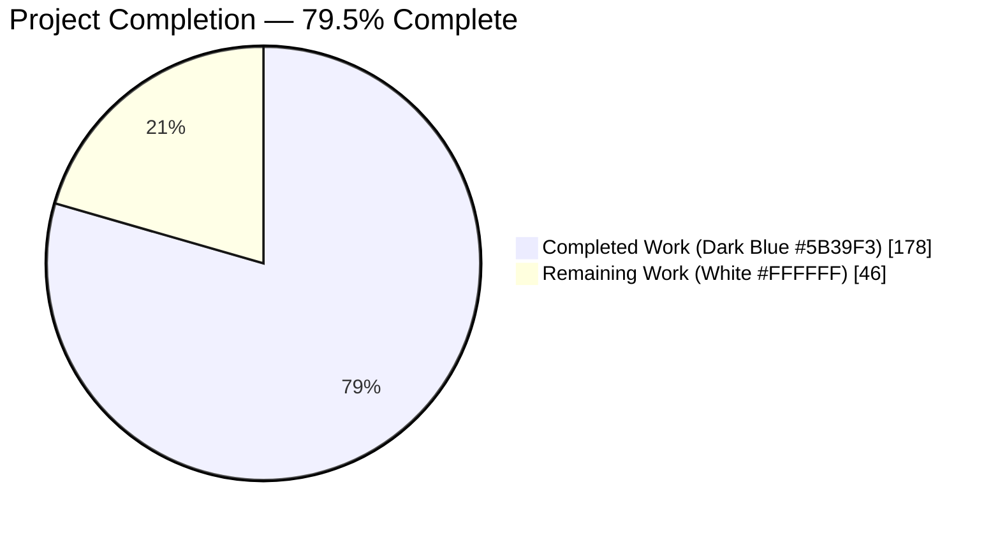
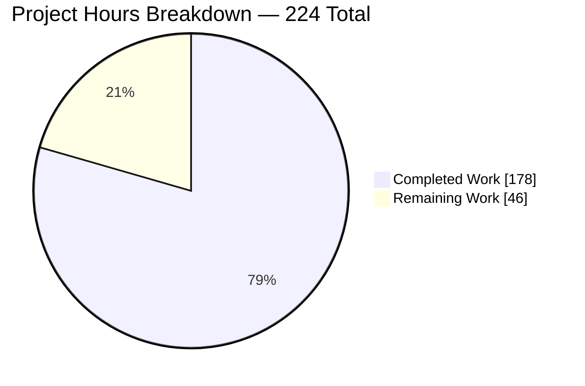
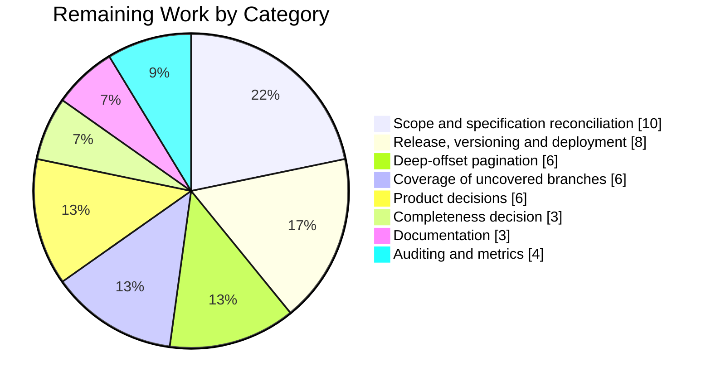
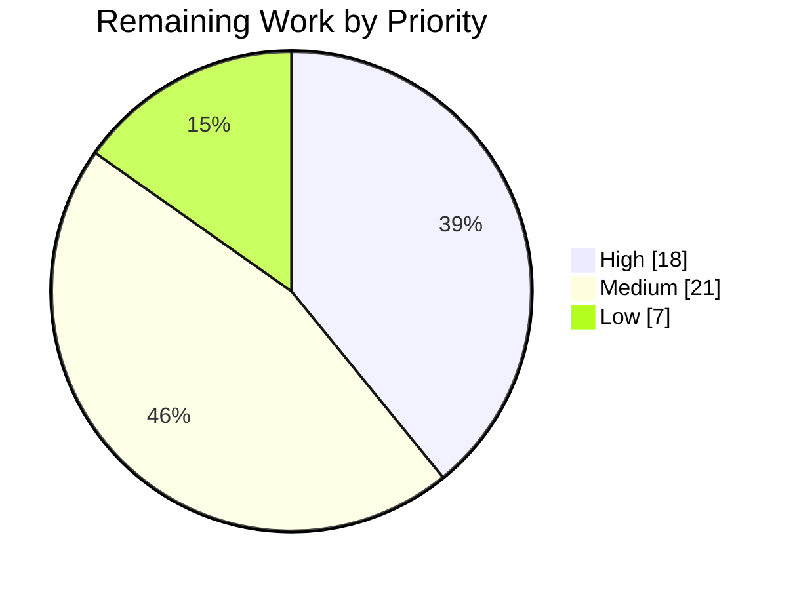

# 1. Executive Summary

## 1.1 Project Overview

This project adds a read-only **OAuth Client Security** review to the Medplum Project Admin console. At `/admin/oauth-security` an administrator sees every OAuth client their access policy exposes, the redirect URIs each has registered, and a `pass` / `warning` / `fail` verdict; a per-client view names the offending URI, explains the risk in plain language and states the fix. Verdicts come from a pure evaluator in the server's OAuth module, served by one read-only endpoint behind the existing project-admin gate. Nothing writes, mutates or auto-remediates, and no OAuth request-time behaviour changes.

## 1.2 Completion Status



| Metric | Value |
|---|---|
| **Total Hours** | 224 |
| **Completed Hours (AI + Manual)** | 178 (178 AI + 0 manual) |
| **Remaining Hours** | 46 |
| **Percent Complete** | **79.5%** (178 / 224) |

## 1.3 Key Accomplishments

- ✅ Pure redirect-URI evaluator returning a verdict, reason and fix per finding (`packages/server/src/oauth/clientlint.ts`).
- ✅ Read-only endpoint `GET /admin/projects/:projectId/oauth-security`, project-admin gated and project-scoped server-side.
- ✅ Review list with verdict badges, redirect-URI cells, pagination and a keyboard-reachable route into the detail view.
- ✅ Per-client detail view naming every offending URI with its reason and fix.
- ✅ Admin navigation entry (fourth of nine tabs), both child routes, and a console-wide not-found route.
- ✅ Read-only and no-secret guarantees proven four ways, including a canary sweep of every response body.
- ✅ 227 feature tests inside 9,832 passing tests repository-wide, zero lint errors.
- ✅ Shared console and platform hardening the review depends on: list correctness, accessibility, contrast, database resilience.

## 1.4 Critical Unresolved Issues

**8 items are open.** Three of the 22 requirements ship with a documented contract difference; five cross-cutting items remain. Every requirement passes end to end — what is open is reconciliation, one unreachable branch, and release decisions.

| Issue | Impact | Owner | ETA |
|---|---|---|---|
| Delivered change set spans 59 paths against a 12-path declaration, including public API additions to `@medplum/core` and `@medplum/react` | Release review must cover two published packages and five console screens that inherit the shared changes | Tech Lead | 1 day |
| No decision record in the repository for the post-plan contract decisions (sixth rule, response envelope, request bounds, table shape) | The "why" behind four shipped contract differences is not discoverable from the codebase | Tech Lead | 1 day |
| Deep pagination: an offset inside the result set but above the platform search ceiling is refused rather than served | Projects above 10,000 readable clients cannot page that deep by offset; the branch is untestable at current volumes | Backend | 1 day |
| Response envelope and request bounds differ from specification: six keys plus `omittedFindings`, a 200-id cap, a 4 MiB truncation contract | Consumers must read `truncated`; a 1,000-id request is refused rather than served | Backend | 0.5 day |
| The review is bounded by the caller's access policy rather than by project membership | An administrator with a restrictive custom policy sees an incomplete review and could read a clean screen as a clean project | Product + Security | 0.5 day |
| Redirect URIs using `javascript:` or `data:` schemes report `pass` with no findings | A dangerous scheme reads as reviewed and clean; the rule set is deliberately closed to the named patterns | Security | 1 day |
| Uncovered defensive and platform branches (fail-closed colour fallbacks, five connection SQLSTATEs, reader-pool discard, bootstrap and retry paths) | No automated signal if one of these regresses | Backend | 1 day |
| No access auditing or metrics on the report endpoint | Who reviewed which project's OAuth posture is not recorded | Platform Ops | 0.5 day |

## 1.5 Access Issues

No access issues identified. The repository, the pinned Node 24.21.0 / npm 10.9.9 toolchain, the PostgreSQL 16 and Redis 7 services and the seeded administrator credentials were all reachable, and install, build, lint and every test suite ran unobstructed. Deploying the feature needs no new credential.

## 1.6 Recommended Next Steps

1. **[High]** Sign off — or revert — the 47 delivered paths outside the declared scope, including the two published packages' API additions.
2. **[High]** Publish a decision record for the four shipped contract differences, so documentation matches the code.
3. **[High]** Decide package versioning for `@medplum/core` and `@medplum/react`, then deploy and smoke-test the screens and endpoint.
4. **[Medium]** Settle the deep-offset posture — cursor paging or a documented refusal — and cover the branch.
5. **[Medium]** Decide whether `javascript:`/`data:` redirect schemes should be flagged, and whether a policy-bounded review needs a stronger warning.

# 2. Project Hours Breakdown

## 2.1 Completed Work Detail

| Component | Hours | Description |
|---|---|---|
| OAuth redirect-URI lint evaluator | 20 | `packages/server/src/oauth/clientlint.ts` — six rule identifiers, bare-origin detection with a loopback exemption, raw-string wildcard test, per-URI prefix-matching rule, ordered registration-discoverable first match, zero-URI pass row, unparseable-entry rule, verbatim reason/remediation copy, worst-severity aggregation, and totality for any shape the database can hold |
| Evaluator unit suite | 8 | `clientlint.test.ts` — 71 cases over rule boundaries, the loopback table, registration order and source variants, copy strings, edge cases and determinism/non-mutation |
| Report endpoint handler | 24 | `packages/server/src/admin/clientsecurity.ts` — project resolution for admin and super-admin callers, a three-parameter whitelist, forced server-derived `_project` filter, target-project setting resolution, registration-discoverable option derivation, response-size bounding with finding-level truncation, and typed refusals |
| Endpoint integration suite | 10 | `clientsecurity.test.ts` — 94 cases over authorization, tenancy and scoping, the validation matrix, paging, option derivation, payload hygiene and the truncation contract |
| Route registration and inherited gate | 2 | One `GET` registration on the project-admin router (`packages/server/src/admin/project.ts`), inheriting `authenticateRequest` and `verifyProjectAdmin` |
| Console page shell, gate, scope note, title | 3 | `OAuthClientSecurityPage.tsx` — admin/super-admin gate returning a forbidden alert, heading, read-only scope note, document title with restore on unmount |
| Results table | 18 | `OAuthClientSecurityTable.tsx` — `SearchControl` list with computed Name, Security, Redirect URIs and Review columns, name sort, forced-fresh search, id-keyed report fetch with a stale-response guard, settling states for every cell, bidi-control escaping |
| Per-client detail view | 12 | `OAuthClientSecurityDetailPage.tsx` — client-id validation, five render states, one alert per finding with URI, reason and suggested fix, aggregate badge, back link, document title |
| Console component suites | 12 | `OAuthClientSecurityPage.test.tsx` (37) and `OAuthClientSecurityDetailPage.test.tsx` (25) — columns, badges, pagination, settling, navigation, gate, all detail states |
| Admin navigation entry, child routes, not-found page | 5 | Tab entry in `ProjectPage.tsx`, two child routes in `AppRoutes.tsx`, and a console-wide catch-all route to the new `NotFoundPage.tsx` |
| Accessibility, contrast and theme tokens | 8 | Severity badges at 8.90 / 8.17 / 6.39:1, alert titles at 19.69 / 18.66:1, dimmed-text and anchor tokens, pagination control colours (`packages/app/src/index.tsx`) |
| Shared console component hardening | 22 | `@medplum/react` — tab route synchronisation for nested routes, `SearchControl` stale-response suppression, in-flight loading row, navigation landmark and keyboard pagination, table accessible name, `scope`/`aria-sort` semantics, hover and pressed states, reserved pagination position, app-shell chrome and landmark fixes |
| Platform resilience | 12 | Durable pool-client error handling, process survival on a lost database connection, health-check recovery from a dead reserved client, eleven connection SQLSTATEs mapped to 503, and 401 rather than 400 for a malformed bearer token |
| Test-harness and root-gate hygiene | 6 | Schema-diff retry under concurrent DDL, per-run unique index fixtures, a core-bundle precondition guard, a load-tolerant GraphQL timeout, and a temp-directory fixture in the infrastructure suite |
| End-to-end runtime verification | 16 | Live HTTP probes across roles, rule fixtures, paging and hygiene; browser passes at four breakpoints; security and performance sweeps; fault injection of the report request |
| **Total** | **178** | |

## 2.2 Remaining Work Detail

| Category | Hours | Priority |
|---|---|---|
| Scope and specification reconciliation, including the durable decision record for the four shipped contract differences | 10 | High |
| Release: published-package version decisions, deployment, and smoke test of the review screens and endpoint | 8 | High |
| Deep-offset pagination: decide cursor paging or a documented refusal, and cover the branch | 6 | Medium |
| Coverage for — or formal acceptance of — the uncovered defensive and platform branches | 6 | Medium |
| Product decisions: unflagged `javascript:`/`data:` redirect URI schemes and the non-admin refusal experience | 6 | Medium |
| Completeness decision for policy-bounded enumeration versus full project enumeration | 3 | Medium |
| Documentation of the OAuth Security tab and the report endpoint | 3 | Low |
| Report-endpoint access auditing and metrics, and surfacing truncation in the detail view | 4 | Low |
| **Total** | **46** | |

## 2.3 Hours Reconciliation

- Completed hours (Section 2.1 total): **178**
- Remaining hours (Section 2.2 total): **46**
- Total project hours: 178 + 46 = **224**
- Completion: 178 / 224 × 100 = **79.5%**

Every hour traces to a requirement of the agreed scope or to a path-to-production activity needed to deploy it. Confidence is **high** for the ten feature, test and integration rows, whose scope is fixed and whose evidence is executable; **medium** for the five accessibility, shared-component, platform, harness and verification rows, whose extent was set by what verification found; and **medium** for the remaining categories, four of which are decisions rather than implementation and could resolve faster than estimated if taken promptly.

# 3. Test Results

Every figure below was observed in a run on the delivered branch: `CI=true npm test` in `packages/server` (the script excludes the seeding suite), `CI=true npx vitest run` in each of the other packages, and `npm run lint` plus a forced `npm run build:fast` at the root.

| Area / Category | Framework | Tests | Passed | Failed | Coverage | What This Proves |
|---|---|---|---|---|---|---|
| Lint evaluator (`packages/server/src/oauth/clientlint.test.ts`) | Vitest 4.1.11 | 71 | 71 | 0 | All six rules, both registration sources, every edge case and the copy strings | A client's redirect-URI configuration is classified identically on every call, from the resource alone, without touching the network, database or clock |
| Report endpoint (`packages/server/src/admin/clientsecurity.test.ts`) | Vitest + supertest | 94 | 94 | 0 | Authorization, tenancy, validation matrix, paging, option derivation, payload hygiene, truncation | Only project and super administrators receive a report, it covers exactly the resolved project, malformed input is refused rather than reinterpreted, and no secret-bearing field reaches the response |
| Console review screens (`OAuthClientSecurityPage.test.tsx`, `OAuthClientSecurityDetailPage.test.tsx`) | Vitest + Testing Library (jsdom) | 62 | 62 | 0 | Columns, badges, pagination, stale/missing/failed settling, navigation, gate, all detail states | The list and detail view render the verdicts they are given, every cell reaches a settled state, and a non-administrator sees a refusal instead of data |
| Whole console package (`@medplum/app`) | Vitest (jsdom) | 535 | 535 | 0 | 71 test files | The new tab, routes and not-found page coexist with every existing console screen |
| Whole server package (`@medplum/server`) | Vitest + supertest + PostgreSQL 16 / Redis 7 | 5,052 | 5,038 (1 expected fail, 13 skipped) | 0 | 270 test files | The endpoint, the OAuth request-time surface it reports on, and the platform resilience changes hold together under the full server suite |
| Shared component library (`@medplum/react`) | Vitest (jsdom) | 1,426 | 1,426 | 0 | 156 test files | The tab strip, list control and app-shell changes behave for all five consuming console screens |
| Core, mock and infrastructure packages (`@medplum/core`, `@medplum/mock`, `@medplum/cdk`) | Vitest | 2,808 | 2,806 (2 expected fail, 43 skipped) | 0 | 81 test files | The new outcome factories carry the intended HTTP statuses, and the root test gate leaves no artefact behind |
| Static gates | ESLint 9 / TypeScript 6.0.3 / Turbo | 91 lint tasks + 10 build tasks | 101 | 0 | Whole repository, uncached | Zero lint errors repository-wide, and both packages type-check and bundle from a cold cache |

**Totals observed: 9,832 tests passed across 578 test files, 0 failures** (3 expected failures and 56 skips are pre-existing suite fixtures). Feature-specific: 227 tests.

### Not Covered

These were delivered but are exercised by no test, and a human should decide whether each needs coverage or formal acceptance before release:

- **Deep-offset paging.** The branch that refuses an offset inside the result set but above the platform search ceiling needs a project with more than 10,000 readable clients to reach; the reachable half — an empty page with an accurate total — is covered.
- **Fail-closed colour fallbacks** in the list and detail view. An unrecognised status is discarded by the status validator before these branches can paint.
- **Defensive guards**: the non-`ClientApplication` bundle-entry skip, the absent-path-parameter branch of project resolution, the forbidden guard around the cross-project project read, and the empty-cell fallback for a row with no id.
- **Five of the eleven database connection SQLSTATEs**, the `PANIC` severity branch, the default-text service-unavailable outcome, and the reader-pool discard path — unit-covered, but never emitted by a live PostgreSQL. The bootstrap-failure and connection-retry paths were likewise not driven at runtime.
- **The no-router tab-strip branch, the tab `aria-label` override and the table accessible-name prop override** — no screen in this repository takes those paths today.
- **Dark colour-scheme arms** of the new stylesheet rules and of the theme variable resolver; the console ships no scheme switch on these screens.
- **The hover-removal half of the review link's underline treatment** — gated behind a pointing-device media query that neither jsdom nor headless Chrome advertises.
- **Bidi-control escaping applied to a finding's reason and remediation text** — the pass-through path is asserted, the transforming path is not, since those strings are fixed product copy.

# 4. Runtime Validation & UI Verification

The server and console were built, booted against PostgreSQL 16 and Redis 7 from an empty database, and driven over live HTTP and in a real browser as a signed-in administrator, a non-admin member and an anonymous caller.

- ✅ **Start-up and health** — the server boots from `dist`, runs all migrations and seeds on a fresh database, and `GET /healthcheck` returns `{"ok":true, "postgres":true, "redis":true}`; the console serves and signs in with the seeded super-admin account.
- ✅ **Authentication and authorization** — nine-case matrix driven live: project admin 200, super admin 200, non-admin member of the same project 403 with the `forbidden` outcome, anonymous 401, admin naming another project 403, super-admin project targeting honoured, non-UUID path segment falling back to the caller's project.
- ✅ **Report endpoint** — 200 with an accurate total matching a direct database count; 26-client and single-id reports; ten ignored query parameters produce byte-identical results, so a caller-supplied project filter cannot widen the read.
- ✅ **Rule evaluation end to end** — thirteen client fixtures (exact, bare origin, wildcard, mixed severities, no URIs, CLI collision, three loopback forms, loopback wildcard, client-credentials grant, duplicate URI, deprecated singular field, 50 URIs) each returned the expected rule identifiers and verdict; enabling the dangerous-redirect project setting produced 29 prefix findings and escalated the bare-origin verdict, and disabling it reverted them.
- ✅ **Review list screen** — 49 clients across three pages, every Security cell settling from its placeholder to a badge, badges matching the API row for row, redirect-URI cells correct for multi-URI, duplicate, 300-character and zero-URI clients, and an em-dash where no URI is registered.
- ✅ **Detail view** — all render states driven: findings with URI, reason and suggested fix; no findings; the zero-URI pass row; a client outside the project ("not visible in this project"); an invalid client id ("Invalid OAuth client id." with zero requests issued); and an unmatched deep route showing the not-found page.
- ✅ **Navigation and freshness** — the "OAuth Security" tab is fourth of nine and resolves to the review list; the tab stays selected on the detail route; returning to the list inside the client cache window still issues a fresh search, so rows and verdicts describe the same moment.
- ✅ **Failure path** — with the report request faulted, all twenty Security cells settle to the em-dash rather than remaining placeholders, a dismissible notification appears, and restoring the endpoint restores real badges.
- ✅ **Read-only and no-secret guarantees** — after twelve report calls of six shapes: unchanged row counts in the database, unchanged `meta.versionId`, `_history` total still 1, no create/update/delete/patch in the server log, and zero occurrences of the canary secret or retiring-secret values anywhere in the responses.
- ✅ **Protected OAuth surface and responsiveness** — an exact registered redirect URI still authorizes while a path-extended one is refused, registration still returns only the client id, issued-at and redirect URIs with no secret, and a token still mints; both screens render at 375 / 768 / 1280 / 1920 px with no overflow, clipping or overlap and no console errors.

**Not exercised at runtime:** database-failure injection for the resilience changes — terminating live connections was not possible against the database in use, so those paths rest on their unit suites — the deep-offset refusal above the platform search ceiling, and the dark colour scheme.

# 5. Compliance & Quality Review

## 5.1 Compliance Matrix

| Deliverable | Benchmark | Status | Evidence |
|---|---|---|---|
| Pure lint evaluator (R10) | No I/O, deterministic, non-mutating, unit-testable in isolation | ✅ Pass | `packages/server/src/oauth/clientlint.ts` imports one value (`getClientRedirectUris`) and otherwise types; 71 unit tests including determinism and non-mutation |
| Rule set and copy (R3–R7, R15–R17) | Every named risky pattern detected; reason and remediation per finding; loopback not false-flagged | ✅ Pass | Thirteen live fixtures plus the unit table; twelve specified copy strings compared byte for byte |
| Report endpoint (R11) | One read-only route, server-side authorization, project-scoped | ⚠️ Pass with divergence | `packages/server/src/admin/clientsecurity.ts`; 94 integration tests; envelope carries two keys beyond specification (§5.2) |
| Endpoint authorization (R13) | Project admins and super admins only, enforced server-side | ✅ Pass | Router-level `authenticateRequest` + `verifyProjectAdmin`; nine-case live matrix 200/200/403/401/403 |
| Tenancy isolation | A caller cannot read another project's clients | ✅ Pass | Forced server-derived project filter; cross-project request refused 403; ten ignored parameters produce identical digests |
| Read-only guarantee | No write path, nothing persisted | ✅ Pass | Search-only handler; row counts, `meta.versionId`, `_history` and the server log unchanged after twelve report calls |
| No-secret guarantee | No secret-bearing field in any response | ✅ Pass | Five-field results; canary secret and retiring secret absent from every serialized body |
| Console list and detail (R1, R2, R8, R9, R12) | Clients, URIs, verdict column, detail explanation, navigation entry | ✅ Pass | 62 component tests; browser verification at four breakpoints; tab fourth of nine |
| Pagination (R14) | Large client counts are pageable | ⚠️ Pass with divergence | Disjoint pages, union equals total, UI paging verified; deep-offset branch refused rather than served (§5.2) |
| Data fetching (R21) | Existing `@medplum/core` search patterns, no new mechanism | ✅ Pass | `SearchControl` search plus `medplum.get` with no-cache; zero resource reads from the detail view |
| Dependencies and configuration (R22) | No new dependency, environment variable or configuration | ✅ Pass | Empty diff over manifests, lockfile, server config files, Turbo/Vite/Vitest/TS configs and workflows |
| Change-set scope and decision recording | Exhaustive twelve-path scope; rationale documented outside code comments | ❌ Fail | 59 paths delivered; rationale for four shipped contract differences is not present in the repository (§5.2) |

## 5.2 AAP & Rule Divergences and Gaps

| What the AAP/Rule Required | What Was Delivered Instead | Why It Diverged | Impact | Remediation |
|---|---|---|---|---|
| Twelve in-scope paths, declared exhaustive; shared packages read-only | 59 paths, 47 of them outside the declaration, including public API additions to `@medplum/core` and `@medplum/react` | The review's dependencies — the shared list, tab strip and chrome components, and the platform's database-failure handling — needed changes the plan treated as read-only; correcting them at the root was chosen over patching the consuming screen | Two published packages and five console screens inherit changes the plan did not sanction; the scope invariant fails | Sign off the 47 paths with their rationale, or revert and re-solve inside the twelve |
| Rule set fixed at five identifiers; "no rule is added for malformed URIs" | A sixth rule reports an unparseable or non-string registered value as unevaluated, status `warning` | Literal compliance returned a green `pass` for a redirect URI that could not be parsed, and a null array element made the whole report fail | Safer verdicts; three existing clients move from `pass` to `warning`; rule-set documentation is now behind the code | Adopt the sixth rule into the rule-set documentation and copy table |
| Response body `{ total, offset, count, results }`; result fields limited to five | `{ total, offset, count, returned, truncated, results }`, with `omittedFindings` added to a bounded result | A truthful served count and a visible truncation signal were needed once responses had to be size-bounded | Additive only; a consumer that ignores unknown keys is unaffected, but truncation is invisible unless `truncated` is read | Document the two keys; surface truncation in the detail view |
| Requested-id list capped at 1,000; `_count` accepted to 1,000 | Id list capped at 200; a list beyond roughly 420 ids is refused by the HTTP server with a bodyless 431; responses bounded to 4 MiB with finding-level truncation and 413 when nothing fits | The 1,000-id refusal was unreachable within the default HTTP header budget, and an unbounded response was a resource-consumption risk | Maximum id-scoped page is 200 clients; a pathological client can have findings truncated | Raise the header budget deliberately if 1,000 is wanted; otherwise document the cap |
| `_offset` accepted with no clamp; an offset beyond the set returns an empty page and a correct total | Unchanged beyond the set, but an offset inside the set and above the platform search ceiling is refused with a `badRequest` naming the ceiling | The repository refuses such offsets; a cursor walk was built to bridge it and then withdrawn as unbounded work for a read-only report | Projects above 10,000 readable clients cannot page that deep by offset; id-scoped requests remain available | Decide cursor paging or keep the documented refusal, and cover the branch |
| Two computed columns with a name field and specified badge and placeholder styling | Four columns (Name, Security, Redirect URIs, Review) with no field columns, a name sort, a resized placeholder, filled shade-qualified badges, and one theme file change | Keyboard reachability, long-URI overflow pushing the verdict column off screen, layout-shift measurement and contrast thresholds each required a different value from the one specified | The screen differs structurally and visually from the plan, in every case verified and measured | Accept in design review, or restate the specification to match |
| List every `ClientApplication` in the project | Every client the signed-in administrator's access policy permits them to read | Literal completeness requires the access-policy change the request forbids; the plan itself qualified the requirement this way | An administrator with a restrictive custom policy sees an incomplete review — verified returning a total of zero | Product decision: accept with the on-screen note, or widen deliberately |
| Rule 1: every non-trivial decision in a decision log; rationale never in code comments | Code carries contract documentation only, as required, but the repository carries no decision log for the roughly thirty decisions taken after planning | The planning register was frozen and declared to force no repository artefact into scope, so each decision was recorded outside the codebase | A maintainer cannot discover from the repository why the sixth rule, the envelope, the bounds or the table shape are as they are | Publish a decision record covering the shipped contract differences |

**Scope.** The plan fixed the change set at twelve paths and treated shared packages as read-only. What shipped is 59 paths: the twelve, plus 47 carrying list correctness, accessibility, contrast, database-failure resilience, authentication-error hygiene, a console-wide not-found route and test-gate fixes. Two are consequential — `packages/core/src/outcomes.ts` adds `serverUnavailable()` and `internalServerError()` to a published API behind the API Extractor gate, and `packages/react/src/SearchControl/SearchControl.tsx` adds an optional `tableAriaLabel` prop plus behavioural changes five console screens inherit. All 14 protected OAuth, access-policy and schema paths are byte-identical to the base commit, and no manifest, lockfile or configuration file changed. Read the shared-package diff as a product change, not as feature plumbing.

**The sixth rule.** `packages/server/src/oauth/clientlint.ts:31` declares `UnparseableRedirectUri: 'OCS-006'`, which the plan's five-identifier rule set does not contain and whose §0.5.2 states no rule is added for malformed URIs. Following that literally produced a green `pass` for a bare-origin URI whose host carried a right-to-left override — a verdict asserting a check that never ran — and a JSON `null` inside `redirectUris`, which a non-admin member can store through the ordinary API, aborted the entire report. The rule reports such an entry as unevaluated at `warning`, never `fail`, and is never escalated by the dangerous-redirect setting. Three existing clients move from `pass` to `warning`; none moves to `fail`.

**Response envelope.** `clientsecurity.ts` sends six members — `total`, `offset`, `count`, `returned`, `truncated`, `results` — where the plan specified four, and a result whose findings were bounded carries `omittedFindings`. `returned` exists because a page can be shorter than `count` once a size bound applies, and reporting `count` as the served number would be untrue; `truncated` exists so a reviewer is never shown a silently shortened security report. The console validator reads only the four original members, so nothing on screen depends on the additions. The cost is that a consumer unaware of `truncated` cannot tell a complete report from a bounded one: surfacing it in the detail view is the follow-up.

**Request bounds.** The plan capped the requested-id list and `_count` at 1,000. `clientsecurity.ts:40` caps ids at 200, and a list beyond roughly 420 ids never reaches the handler at all — the HTTP server refuses it with a bodyless 431, because 1,000 UUIDs exceed the default header budget, making the specified refusal unreachable. `_count` still clamps to 1,000. Separately, `MAX_REPORT_RESPONSE_BYTES` bounds a response to 4 MiB: a client whose findings do not fit has them truncated with a count, and a page whose first client cannot be served at all is refused with 413 naming that client. Measured at the limit: 4,194,044 bytes with 867 findings omitted.

**Deep pagination.** The plan promised an unclamped `_offset`. The repository refuses any offset above its configured search ceiling, default 10,000, so the two contracts collide. A cursor walk was built to bridge it and then withdrawn, because walking to an arbitrary offset is unbounded work on a read-only report. `clientsecurity.ts:353` now answers such a request with a `badRequest` naming the ceiling, while an offset merely beyond the end of the set still returns an empty page with an accurate total. No project at plausible scale is affected, and id-scoped requests reach any client directly. The branch cannot be exercised below 10,000 readable clients, which is why it also appears as uncovered.

**Table and design deltas.** `OAuthClientSecurityTable.tsx` renders four columns rather than two, sorts by name, requests no field columns, sizes its placeholder 74×20 rather than the pinned 22×70, and paints filled shade-qualified severity badges instead of light bare-palette ones; `packages/app/src/index.tsx` gained a theme variable resolver. Each value was changed for a measured reason: a keyboard-reachable route into the detail view, an unbreakable redirect URI pushing the verdict column off screen, a placeholder that matched no settled badge and caused layout shift, and contrast below 4.5:1. The delivered badges measure 8.90 / 8.17 / 6.39:1. The screen is verifiably better and verifiably different from the drawing.

**Policy-bounded review.** Both data paths run through the caller's own access-policy-bounded repository, so the screen reports every client the administrator can read rather than every client in the project — the qualification the plan itself made, because literal completeness needs the access-policy change the request forbids. The consequence is real: an administrator carrying a restrictive custom policy was verified receiving a successful report with a total of zero, which reads on screen as a clean project. The list screen states its scope in a dimmed note under the heading. Whether that is sufficient, or whether the resource type should be reclassified so administrators always see every client, is a product decision.

**Rule 1.** The rule requires every non-trivial decision in a four-column decision log and forbids rationale in code comments. The second half holds: the delivered sources carry only the required licence header and contract documentation, with no rationale and no advisory identifiers. The first half does not, in the place that matters to a maintainer. The planning register was frozen and explicitly declared to force no repository artefact into scope, so the roughly thirty decisions taken after planning — the sixth rule, the truncation contract, the id cap, the envelope, the four-column table, the theme shades, each shared-package edit — were recorded outside the codebase. A reader opening this repository finds the code and no "why". Publishing a decision record is the remedy, and the first High-priority task.

# 6. Risk Assessment

Forward-looking risks only — what could still go wrong once this ships.

| Risk | Category | Severity | Probability | Mitigation | Status |
|---|---|---|---|---|---|
| Two published packages carry new public API and behavioural changes that five console screens and every downstream consumer inherit on the next release | Technical | Medium | Medium | API Extractor gate passed and 4,030 tests across the two packages are green; needs an explicit version/changeset and release-note decision | Open |
| Redirect URIs using `javascript:` or `data:` schemes are reported `pass` with no findings, so a dangerous scheme reads as reviewed and clean | Security | Medium | Medium | The rule set is deliberately closed to the named patterns; add a scheme rule as a scoped follow-up, and brief reviewers meanwhile | Open |
| The review is bounded by the caller's access policy, so an administrator with a restrictive custom policy can read a clean screen as a clean project | Security | Medium | Low | Both data paths share the same policy so rows and verdicts cannot disagree; the screen states its scope; a product decision is pending | Open |
| The admin gate protects the verdicts, not the client list: a non-admin member can still read `ClientApplication` resources, secrets included, through the generic FHIR search | Security | Medium | Medium | Stock platform access-policy behaviour that this work was required to leave untouched; tighten per-tenant access policies | Accepted |
| Projects above 10,000 readable clients cannot page deep by offset, and the refusal branch has no test signal at reachable data volumes | Technical | Medium | Low | Id-scoped requests reach any client directly; decide cursor paging if the ceiling is ever hit | Open |
| A page whose first client evaluation exceeds the 4 MiB bound returns truncated findings, or 413 when nothing fits; a consumer that ignores `truncated` cannot tell | Integration | Low | Low | Measured at the limit (4,194,044 bytes, 867 findings omitted); surface truncation in the detail view | Open |
| No audit trail or metric on report access, so who reviewed which project's OAuth posture is unrecorded | Operational | Low | Medium | Add structured logging and a counter to the endpoint; the platform's request log records the call but not the review intent | Open |
| During an endpoint outage each page load costs three attempts, because the console's client retries twice | Operational | Low | Low | Known client behaviour; monitor and rate-limit the route if outages are expected | Open |

# 7. Visual Project Status

Completed work is shown in Dark Blue `#5B39F3`; remaining work in White `#FFFFFF`.



Remaining hours by category (Section 2.2, 46 hours total):



Remaining work by priority:



| Dimension | Completed | Remaining | Total |
|---|---|---|---|
| Hours | 178 | 46 | 224 |
| Requirements (of 22) | 21 completed, 1 partially completed | 1 partially completed | 22 |
| Share of project | 79.5% | 20.5% | 100% |

# 8. Summary & Recommendations

The OAuth Client Security review is functionally complete and verified. A project administrator can open `/admin/oauth-security`, see every OAuth client their access policy exposes with its registered redirect URIs and a `pass` / `warning` / `fail` verdict, and click through to a per-client explanation that names the offending URI, states the risk in plain language and gives the fix. The verdicts come from a pure evaluator that takes a resource and two options and returns the same answer every time; the report is served by one read-only route behind the existing project-admin gate, scoped by a server-derived project filter the caller cannot influence. Twenty-one of the twenty-two agreed requirements are complete and one — pagination — is complete except for a branch unreachable below 10,000 clients. On hours, **178 of 224 are delivered: 79.5% complete**.

The evidence is executable and first-hand. 9,832 tests pass across 578 files with zero failures, 227 of them dedicated to this feature; the repository lints with zero errors and both packages type-check and bundle from a cold cache. Beyond the suites, the feature was driven live: a nine-case authorization matrix, thirteen client fixtures whose verdicts were compared against the API and the database, 49 clients paged in a browser at four viewport widths, all six detail states including an invalid id and a foreign client, and a faulted report request proving every cell settles rather than spinning. The read-only and no-secret guarantees were each proven four ways, and the protected OAuth request-time surface — exact redirect-URI matching, registration disclosure, token issuance — was re-probed unchanged, with all fourteen protected paths byte-identical to the base commit.

What is not finished is reconciliation and release, not function. The delivered change set is 59 paths against a twelve-path declaration; 47 of those carry list correctness, accessibility, contrast, database-failure resilience and test-gate work that belongs to shared code rather than to this feature's own files, and two of them touch published package APIs. Four contract details differ from the specification — a sixth lint rule for unparseable redirect URIs, two extra response keys with a truncation signal, a 200-id request cap with a 4 MiB response bound, and a refusal rather than a service for very deep offsets — each for a reason that improved the product, and none of them recorded inside the repository. That last point is the substantive gap against the project's own explainability rule: the code carries contract documentation only, as required, but a maintainer opening this codebase finds no decision log for the decisions taken after planning.

The critical path to production is short and mostly decisions. Sign off or revert the 47 out-of-declaration paths, with explicit attention to the two published packages; publish a decision record covering the four contract differences so the documentation matches the code; then choose the package versioning, deploy, and smoke-test the two routes and the endpoint. Three product decisions can run in parallel: whether `javascript:` and `data:` redirect URI schemes should be flagged rather than passed, whether a policy-bounded review needs a stronger on-screen warning, and whether the deep-offset ceiling warrants cursor paging. Success metrics are unambiguous: the endpoint answers 200 for administrators and 403/401 for everyone else, verdicts on screen match the API row for row, and no OAuth request-time behaviour changes after deployment.

**Production readiness: ready on function, gated on reconciliation.** The feature behaves correctly on every requirement exercised end to end, carries no new dependency, environment variable or configuration, and touches no protected surface. The release gate is the shared-package review and the decision record — 18 hours of High-priority work — after which deployment is routine. The residual risks worth carrying into operations are the two security postures this work was required to leave as they are (dangerous URI schemes outside the rule set, and a client list governed by access policy rather than by the admin gate) plus the absence of access auditing on the new endpoint.

# 9. Development Guide

Every command below was executed against this checkout. Run them from the repository root unless a `cd` is shown.

## 9.1 System Prerequisites

- **Node.js 24.21.0** and **npm 10.9.9** — the root manifest pins `engines.node` to `>=22.22.0 <23.0.0 || >=24.2.0 <25.0.0` and `packageManager` to `npm@10.9.9`. Node 22.x also satisfies the range; 24.x is what this branch was built and tested on.
- **Docker** with the Compose plugin, for PostgreSQL 16 and Redis 7.
- Linux or macOS, 8 GB or more of RAM free for builds and the server suite.
- No secret, API key or third-party account is required.

```bash
node -v    # v24.21.0
npm -v     # 10.9.9
npx tsc --version      # Version 6.0.3
npx vitest --version   # vitest/4.1.11
```

If an older Node resolves first, put the pinned major ahead of it (`nvm use 24`, or prepend its `bin` directory to `PATH`), and raise the heap for builds and test runs:

```bash
export NODE_OPTIONS='--max-old-space-size=8192'
```

## 9.2 Environment Setup

```bash
# 1. Install workspace dependencies from the committed lockfile (~2 min, ~2850 packages)
npm ci --no-audit --no-fund

# 2. Start PostgreSQL 16 and Redis 7
docker compose up -d

# 3. Confirm both are healthy
docker compose ps
docker compose exec -T postgres pg_isready -U medplum
# expect: /var/run/postgresql:5432 - accepting connections
```

Services listen on `127.0.0.1:5432` (user/password `medplum`/`medplum`) and `127.0.0.1:6379` (password `medplum`). The console's `.env` is generated from `packages/app/.env.defaults` by the Vite/Vitest config, so nothing needs editing:

```text
MEDPLUM_BASE_URL=http://localhost:8103/
MEDPLUM_CLIENT_ID=
GOOGLE_CLIENT_ID=
RECAPTCHA_SITE_KEY=6LfHdsYdAAAAAC0uLnnRrDrhcXnziiUwKd8VtLNq
MEDPLUM_REGISTER_ENABLED=true
```

One shell note: when a compose command's output is piped into `head` or `tail` the pipe can stay open and the command appears to hang — read its output directly, or redirect it to a log file outside the checkout and read that file.

## 9.3 Build

```bash
npm run build:fast
# turbo run build --filter=@medplum/app --filter=@medplum/server
# expect: Tasks: 10 successful, 10 total
```

`tsc` runs before each bundler, so a clean run is also the type check. Add `--force` to defeat the Turbo cache (`npx turbo run build --filter=@medplum/app --filter=@medplum/server --force`, ~51 s). A Vite chunk-size advisory on the console bundle is pre-existing and expected.

## 9.4 Running the Application

```bash
# Server (port 8103 by default; first boot of an empty database runs all migrations, ~4 min)
cd packages/server
npm run dev            # tsx watch
# or, from a build: npm run build && npm start

# Console (port 3000), in a second shell
cd packages/app
npm run dev            # vite
```

To run against a private database and port block, pass the overrides on the same command line as the start command — the config loader reads `file:medplum.config.json,env` and maps `MEDPLUM_*` names onto config keys:

```bash
cd packages/server && npm run build
MEDPLUM_PORT=8271 MEDPLUM_BASE_URL=http://localhost:8271/ \
MEDPLUM_APP_BASE_URL=http://localhost:8270/ MEDPLUM_STORAGE_BASE_URL=http://localhost:8271/storage/ \
MEDPLUM_DATABASE_DBNAME=medplum_dev1 MEDPLUM_BINARY_STORAGE=file:./binary-dev1/ MEDPLUM_REDIS_DB=11 \
npm start
```

Redis logical databases 7–10 are reserved by the server test harness, so pick another for a private stack.

## 9.5 Verification

```bash
# Server health
curl -s http://localhost:8103/healthcheck
# {"ok":true,...,"postgres":true,"redis":true}

# Feature suites — console (jsdom, no services needed)
cd packages/app
CI=true npx vitest run src/admin/OAuthClientSecurityPage.test.tsx src/admin/OAuthClientSecurityDetailPage.test.tsx
# Test Files 2 passed (2) | Tests 62 passed (62)

# Feature suites — server (needs PostgreSQL + Redis; run this package's tests alone)
cd ../server
CI=true npx vitest run src/oauth/clientlint.test.ts src/admin/clientsecurity.test.ts
# Test Files 2 passed (2) | Tests 165 passed (165)

# Whole-package gates
cd ../app    && CI=true npx vitest run      # 71 files / 535 tests
cd ../server && CI=true npm test            # 270 files / 5038 tests, 1 expected fail, 13 skipped

# Lint and formatting (repository-wide; must stay at 0 errors)
cd ../..
npm run lint                                  # Tasks: 91 successful, 91 total
npx prettier --check packages/server/src/oauth/clientlint.ts packages/server/src/admin/clientsecurity.ts
```

## 9.6 Example Usage

Sign in at `http://localhost:3000` with the seeded super administrator — **admin@example.com / medplum_admin**, created by the server's own seeding on the first boot of a database — then open:

- `http://localhost:3000/admin/oauth-security` — the review list (Name, Security, Redirect URIs, Review).
- `http://localhost:3000/admin/oauth-security/<clientId>` — the per-client findings.

The same data over HTTP, with a project-admin or super-admin bearer token:

```bash
curl -s -H "Authorization: Bearer $TOKEN" \
  "http://localhost:8103/admin/projects/$PROJECT_ID/oauth-security?_count=20&_offset=0"
```

```json
{
  "total": 26, "offset": 0, "count": 20, "returned": 20, "truncated": false,
  "results": [
    {
      "id": "…", "name": "Patient Portal", "redirectUris": ["https://app.example.com"],
      "status": "warning",
      "findings": [
        { "ruleId": "OCS-001", "status": "warning", "redirectUri": "https://app.example.com",
          "reason": "Registered as an origin with no callback path, …",
          "remediation": "Register the exact callback URL the application uses, …" }
      ]
    }
  ]
}
```

Scoped to particular clients: `?_id=<uuid>,<uuid>` (at most 200 ids). Expected refusals: **401** with no token, **403** for an authenticated non-administrator or a mismatched project id, **400** for a malformed `_id`, `_count` or `_offset`, **413** when a single client's report cannot fit the 4 MiB bound.

## 9.7 Troubleshooting

- **Server suite fails with ~81 `NotFound` errors across ~31 files.** A bare `npx vitest run` in `packages/server` includes the seeding suite, which clears shared Redis keys and invalidates the cache-only login the harness holds. Use `CI=true npm test` — the package script excludes that file by design.
- **`EADDRINUSE` on port 8104, or unexplained data-dependent failures.** The server suite binds that port and shares the `medplum_test` database; run it alone. Console tests are jsdom-only and safe to run in parallel.
- **Missing `StructureDefinition` errors in server tests.** The test database needs seeding: `npx turbo run test:seed --filter=./packages/server`, run alone.
- **`npm run lint` reports warnings.** 22 in `@medplum/app` and 32 in `@medplum/react` are the documented baseline. The error count must stay at 0; new files must carry the exact two-line SPDX header, and `test.only` / `describe.only` are lint errors.
- **A command that pipes `docker compose exec` into `head` or `tail` appears to hang.** The pipe stays open; redirect to a file and `cat` it.
- **Console shows "Something went wrong / Forbidden" across `/admin`.** The signed-in account is not a project administrator; the admin area's own project read is refused before any page-level gate.
- **Security cells stay as placeholders.** The report request failed; the console raises a dismissible notification and settles every cell to an em-dash. Check the server log and `curl` the endpoint directly.

# 10. Appendices

## A. Command Reference

| Purpose | Command | Observed result |
|---|---|---|
| Install dependencies | `npm ci --no-audit --no-fund` | ~2850 packages, exit 0 |
| Build console + server | `npm run build:fast` | Tasks: 10 successful, 10 total |
| Build ignoring cache | `npx turbo run build --filter=@medplum/app --filter=@medplum/server --force` | 10/10, 0 cached, 50.7 s |
| Lint whole repository | `npm run lint` | Tasks: 91 successful, 91 total; 0 errors |
| Format check | `npx prettier --check <paths>` | All matched files use Prettier code style |
| Console feature tests | `cd packages/app && CI=true npx vitest run src/admin/OAuthClientSecurityPage.test.tsx src/admin/OAuthClientSecurityDetailPage.test.tsx` | 2 files / 62 tests passed |
| Server feature tests | `cd packages/server && CI=true npx vitest run src/oauth/clientlint.test.ts src/admin/clientsecurity.test.ts` | 2 files / 165 tests passed, 15.5 s |
| Whole console suite | `cd packages/app && CI=true npx vitest run` | 71 files / 535 tests passed |
| Whole server suite | `cd packages/server && CI=true npm test` | 270 files / 5038 passed, 1 expected fail, 13 skipped |
| Shared library suite | `cd packages/react && CI=true npx vitest run` | 156 files / 1426 tests passed |
| Core suite | `cd packages/core && CI=true npx vitest run` | 76 files / 2604 passed, 2 expected fail, 43 skipped |
| Start services | `docker compose up -d` | postgres and redis Up |
| Service health | `docker compose exec -T postgres pg_isready -U medplum` | accepting connections |
| Server health | `curl -s http://localhost:8103/healthcheck` | `{"ok":true,…,"postgres":true,"redis":true}` |
| Seed the test database | `npx turbo run test:seed --filter=./packages/server` | Run alone; only when server tests report missing StructureDefinitions |

## B. Port Reference

| Port | Service | Notes |
|---|---|---|
| 3000 | Console dev server (`packages/app`, Vite) | `npm run dev` |
| 8103 | API server default | `MEDPLUM_PORT` overrides it |
| 8104 | Server test harness HTTP bind | Used by the server suite; run that suite alone |
| 5432 | PostgreSQL 16 | Databases `medplum` (dev) and `medplum_test` |
| 6379 | Redis 7 | Password `medplum`; logical DBs 7–10 reserved by the test harness |

## C. Key File Locations

| Path | Role |
|---|---|
| `packages/server/src/oauth/clientlint.ts` | Pure redirect-URI evaluator: rule identifiers, findings, copy, aggregation |
| `packages/server/src/oauth/clientlint.test.ts` | 71 evaluator unit tests |
| `packages/server/src/admin/clientsecurity.ts` | Report endpoint handler: resolution, validation, scoping, bounding |
| `packages/server/src/admin/clientsecurity.test.ts` | 94 endpoint integration tests |
| `packages/server/src/admin/project.ts` | Project-admin router; carries the one `GET` registration for the report route |
| `packages/app/src/admin/OAuthClientSecurityPage.tsx` | Review screen shell: gate, heading, scope note |
| `packages/app/src/admin/OAuthClientSecurityTable.tsx` | Results table, computed columns, report fetch |
| `packages/app/src/admin/OAuthClientSecurityDetailPage.tsx` | Per-client findings view and its render states |
| `packages/app/src/admin/ProjectPage.tsx` | Admin tab strip; carries the "OAuth Security" entry |
| `packages/app/src/AppRoutes.tsx` | Console route table; both review routes and the catch-all |
| `packages/app/src/NotFoundPage.tsx` | Console not-found screen |
| `packages/app/src/index.tsx` | Mantine theme and CSS variable resolver |
| `packages/react/src/SearchControl/`, `LinkTabs/`, `AppShell/` | Shared list, tab-strip and chrome components the screens rely on |
| `packages/core/src/outcomes.ts` | Operation-outcome factories, including the service-unavailable and internal-error additions |
| `packages/server/src/{database,healthcheck,index}.ts`, `src/fhir/sql.ts` | Database pool, health check, bootstrap and error normalisation |

## D. Technology Versions

| Component | Version |
|---|---|
| Node.js | 24.21.0 (range `>=22.22.0 <23.0.0 \|\| >=24.2.0 <25.0.0`) |
| npm | 10.9.9 (pinned via `packageManager`) |
| TypeScript | 6.0.3 |
| Vitest | 4.1.11 |
| React | 19.3.0 |
| react-router | 8.3.0 |
| Mantine | 8.3.18 |
| `@medplum/*` workspace packages | 5.1.38 |
| PostgreSQL | 16 |
| Redis | 7 |
| Express | 5.2.1 |

## E. Environment Variable Reference

This feature adds no environment variable. The ones below already existed and are the ones you may need to run it.

| Variable | Default | Purpose |
|---|---|---|
| `MEDPLUM_BASE_URL` (console) | `http://localhost:8103/` | API base the console calls; from `packages/app/.env.defaults` |
| `MEDPLUM_PORT` | `8103` | Server HTTP port |
| `MEDPLUM_BASE_URL` (server) | `http://localhost:8103/` | Server's own advertised base URL |
| `MEDPLUM_APP_BASE_URL` | `http://localhost:3000/` | Console base URL used in redirects |
| `MEDPLUM_DATABASE_DBNAME` | `medplum` | Target database |
| `MEDPLUM_REDIS_DB` | `0` | Redis logical database (7–10 reserved by the test harness) |
| `MEDPLUM_BINARY_STORAGE` | `file:./binary/` | Binary storage location |
| `NODE_OPTIONS` | — | Set `--max-old-space-size=8192` for builds and test runs |

Two pre-existing configuration inputs change what the review reports, and neither is written by it: the project setting **`allow-dangerous-redirect`**, which turns on prefix matching and makes every parseable redirect URI a finding, and the server configuration key **`defaultOAuthClients`**, which determines whether a client is reachable through unauthenticated registration.

## F. Developer Tools Guide

- **Turbo** drives build, lint and test across the workspace; `--filter=<package>` narrows a run and `--force` defeats the cache.
- **Vitest** runs every suite. `CI=true` prevents watch mode; the console project uses jsdom, the server project uses the Node environment with a global setup that requires PostgreSQL and Redis.
- **ESLint 9** with the workspace config enforces the two-line SPDX header on new files and fails on `test.only`; `jsdoc` tag correctness is enforced while JSDoc itself is optional. **Prettier** (120 columns, single quotes, import sorting) must stay clean.
- **API Extractor** runs inside the `@medplum/react` and `@medplum/core` build legs and is what catches an unintended change to a published surface — relevant to the two public additions this branch carries.
- **Browser verification** of the review screens needs both dev servers running and a project-administrator session; the list is at `/admin/oauth-security`.

## G. Glossary

| Term | Meaning |
|---|---|
| **Bare-origin redirect URI** | A registered redirect URI with no callback path, so the authorization response lands on the host's root page |
| **Prefix (partial) matching** | Accepting a redirect URI whose path merely starts with a registered path; enabled per project by `allow-dangerous-redirect` |
| **Loopback exemption** | `localhost`, `127.0.0.1` and `[::1]` are not flagged for a missing path, following the standards' native-app carve-out |
| **Registration-discoverable client** | A client whose id or redirect URI also identifies a standard OAuth client that unauthenticated registration will describe |
| **Finding** | One rule outcome: rule id, severity, the offending URI where there is one, a plain-language reason and a suggested fix |
| **Aggregate verdict** | The worst severity among a client's findings — `fail` beats `warning` beats `pass` — so a severe finding cannot hide behind a mild one |
| **`truncated` / `omittedFindings`** | Response signals that the 4 MiB bound shortened a page or a client's finding list |
| **Policy-bounded review** | The report covers the clients the signed-in administrator's access policy permits, not necessarily every client in the project |
| **Project admin / super admin** | The two roles the report endpoint admits, resolved server-side from the authenticated context |
